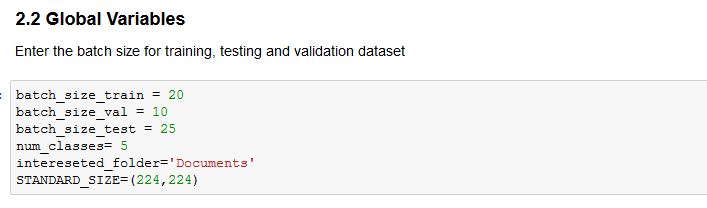

# Pattern Draft

This code pattern focuses on classify a document based on an image and extract the required information using Image Recognition techniques, Optical Character Recognition, Watson Natural Language Understanding and python NLTK.

After completing this pattern, you will learn how to:

* Perform Image Recognition using python libraries such as scikit-learn and keras(deep learning libraries)
* Extract information using Optical Character Recognition
* Use the IBM Watson NLU API to extract metadata from documents in Jupyter notebooks.
* Extract and format unstructured data using simplified Python functions.
* Create and run a Jupyter notebook in DSX.
* Use DSX Object Storage to access data and configuration files.
* Use a configuration file to build configurable and layered classification grammar.
* Use the combination of grammatical classification and regex patterns from a configuration file to extract information.

## Included components

* [IBM Data Science Experience](https://www.ibm.com/bs-en/marketplace/data-science-experience): Analyze data using RStudio, Jupyter, and Python in a configured, collaborative environment that includes IBM value-adds, such as managed Spark.

* [IBM Cloud Object Storage](https://console.bluemix.net/catalog/infrastructure/cloud-object-storage): An IBM Cloud service that provides an unstructured cloud data store to build and deliver cost effective apps and services with high reliability and fast speed to market.

* [Watson Natural Language Understanding](https://console.bluemix.net/catalog/services/natural-language-understanding/?cm_sp=dw-bluemix-_-code-_-devcenter): A IBM Cloud service that can analyze text to extract meta-data from content such as concepts, entities, keywords, categories, sentiment, emotion, relations, semantic roles, using natural language understanding.

## Featured technologies

* [Jupyter Notebooks](http://jupyter.org/): An open-source web application that allows you to create and share documents that contain live code, equations, visualizations and explanatory text.

## 1. Sign up for the Data Science Experience

Sign up for IBM's [Watson Studio](http://datascience.ibm.com/). 
By signing up for the Data Science Experience, two services will be created - ``Spark`` and ``ObjectStore`` in your Bluemix account.

This code pattern is further divided into 3 sections-

* Image Classification of Documents
* Text Extraction Using Optical Character Recognition
* Entity Extraction and Document Classification

# Image Classification of Documents

## 1.  Prepare the Data

The input to this code are a set of images required for training and testing of the model.
To create your own Dataset, follow the following naming structure for each image-

Where, Cheque, Driving_License, None, Pancard and Passport are the classes required to classify by the model.
Or 
You may also use the sample training images provided in the git repo, in the Data folder.

## 2. Create the notebook 

A [notebook](https://datascience.ibm.com/docs/content/analyze-data/notebooks-parent.html) in Watson Studio is a web-based environment for interactive computing. You can run small pieces of code that process your data, and you can immediately view the results of your computation.

Steps:

In [Watson Studio](http://datascience.ibm.com/), click on Create notebook to create a notebook.

* In Watson Studio, click on Create notebook to create a notebook.
* Create a project if necessary, provisioning an object storage service if required.
* In the Assets tab, select the Create notebook option.
* Select the From URL tab.
* Enter a name for the notebook.
* Optionally, enter a description for the notebook.
* Enter this Notebook URL: 
* Select the free Anaconda runtime.
* Click the Create button.

## 3. Add the data file

* Add the all the files in your Data Folder to Object Storage- From the My Projects > Default page, Use Find and Add Data (look for the 10/01 icon) and its Files tab.
* Click browse and navigate to this repo (some name)/data and select all the files

    Note:  It is possible to use your own data files. If you use an image file from your computer, make sure to conform to the naming structure mentioned above.

Fix-up file names for your own data file

If you use your own data and configuration files, you will need to update the variables that refer to the data files in the Jupyter Notebook.

In the notebook, update the global variables in the cell following

2.2 Global Variables section.

    In the notebook, update the global variables in the cell following 2.2 Global Variables section.

Append the filenames list with the names of your image files

## 4. Update the notebook with service credentials

Add the Object Storage credentials to the notebook

Select the cell below  2.1 Add your service credentials for Object Storage section in the notebook to update the credentials for Object Store.

* Delete the contents of the cell
* Use Find and Add Data (look for the 10/01 icon) and its Files tab. You should see the file names uploaded earlier. Make sure your active cell is the empty one below 2.2 Add...
* Select Insert to code (below your sample_text.txt).
* Click Insert Crendentials from drop down menu.
* Make sure the credentials are saved as credentials_1.

# Text Extraction Using Optical Character Recognition

* Install Tesseract OCR. Follow the instructions according to you system specifications
* In the repo download the notebook Convert_Image_to_Text.ipynb 

    ### Configuration
         Fix-up file names for your filename and configuration files in the `2.1 Global Variables` section. 
         In the notebook, update the global variables in the cell following `2.1 Global Variables` section.
         
        
         
    Replace the filename with the path of your image files and name with the desired output text file name
    or 
    Use the image files provided in the git repo /input_image/Rental_agreement and /input_image/Purcahse_agreement

# Entity Extraction and Document Classification

## 1. Create IBM Cloud services

Create the following IBM Cloud service and give a unique name for the service instance:

* [Watson Natural Language Understanding](https://console.bluemix.net/catalog/services/natural-language-understanding)

## 2. Create the notebook 

A [notebook](https://datascience.ibm.com/docs/content/analyze-data/notebooks-parent.html) in Watson Studio is a web-based environment for interactive computing. You can run small pieces of code that process your data, and you can immediately view the results of your computation.

Steps:

In [Watson Studio](http://datascience.ibm.com/), click on Create notebook to create a notebook.

* In Watson Studio, click on Create notebook to create a notebook.
* Create a project if necessary, provisioning an object storage service if required.
* In the Assets tab, select the Create notebook option.
* Select the From URL tab.
* Enter a name for the notebook.
* Optionally, enter a description for the notebook.
* Enter this Notebook URL: 
* Select the free Anaconda runtime.
* Click the Create button.

## 3. Add the data file

* Add the all the files in your Data Folder to Object Storage- From the My Projects > Default page, Use Find and Add Data (look for the 10/01 icon) and its Files tab.
* Click browse and navigate to this repo (some name)/data and select all the files

Note:  It is possible to use your own data files. If you use an image file from your computer, make sure to conform to the naming structure mentioned above.

Fix-up file names for your own data file

If you use your own data and configuration files, you will need to update the variables that refer to the data files in the Jupyter Notebook.

In the notebook, update the global variables in the cell following

2.2 Global Variables section.

In the notebook, update the global variables in the cell following 2.2 Global Variables section.

Append the filenames list with the names of your image files

## 4. Update the notebook with service credentials

#### Add the Watson Natural Language Understanding credentials to the notebook
Select the cell below `2.1 Add your service credentials from IBM Cloud for the Watson services` section in the notebook to update the credentials for Watson Natural Langauage Understanding. 

Open the Watson Natural Language Understanding service in your [IBM Cloud Dashboard](https://console.bluemix.net/dashboard/services) and click on your service, which you should have named `wdc-NLU-service`.

Once the service is open click the `Service Credentials` menu on the left.

In the `Service Credentials` that opens up in the UI, select whichever `Credentials` you would like to use in the notebook from the `KEY NAME` column. Click `View credentials` and copy `username` and `password` key values that appear on the UI in JSON format.

Update the `username` and `password` key values in the cell below `2.1 Add your service credentials from IBM Cloud for the Watson services` section.

#### Add the Object Storage credentials to the notebook
* Select the cell below `2.2 Add your service credentials for Object Storage` section in the notebook to update the credentials for Object Store.
* Delete the contents of the cell
* Use `Find and Add Data` (look for the `10/01` icon) and its `Files` tab. You should see the file names uploaded earlier. Make sure your active cell is the empty one below `2.2 Add...`
* Select `Insert to code` (below your sample_text.txt).
* Click `Insert Crendentials` from drop down menu.
* Make sure the credentials are saved as `credentials_1`.

# Analyze the Results

First run the Image Classification of Documents.ipynb. This notebook will identify a set of legal document from the rest of the input documents. The identified documents are further fed into Convert_Image_to_Text.ipynb. The resulting documents produced are fed as input to the next phase.
The notebook entity_extraction_and_document_classification.ipynb provides the required entities in the document and classify the document based on the configuration files fed as an input to the same
